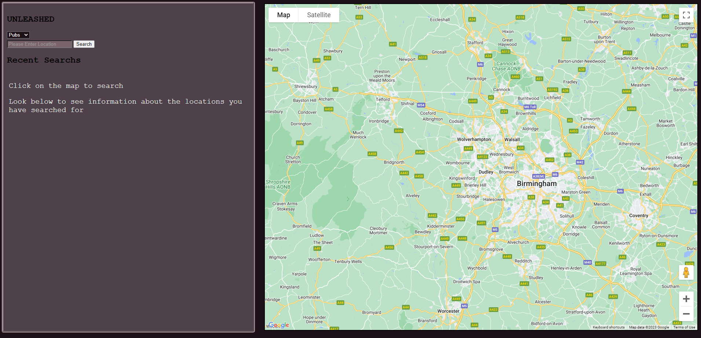
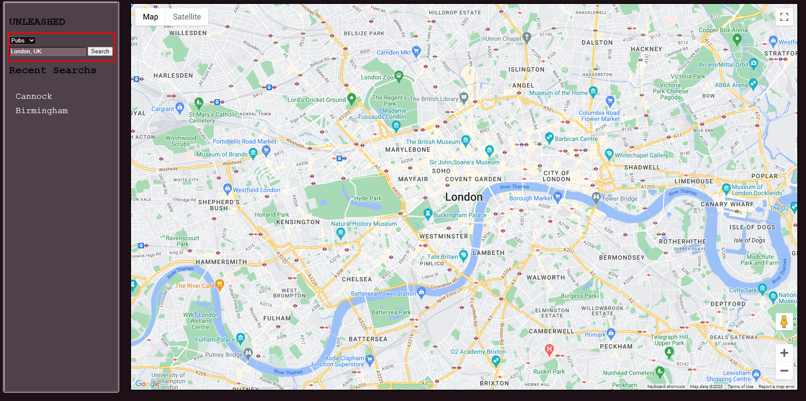
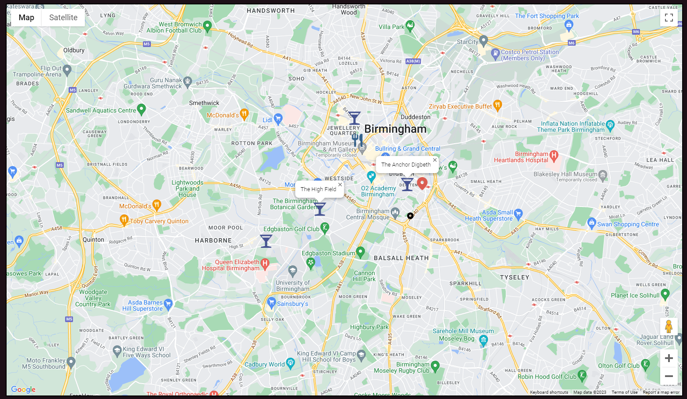
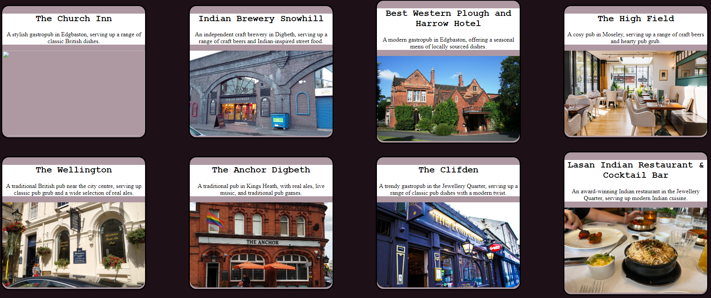

# Unleashed Project

## GitPage

[Website](https://amillsy.github.io/Unleashed/)

_Can't be used because of the inability to publish API keys onto Github_

## Acceptance Criteria

```
AS A socialising enthusiast
I WANT to find nearby venues easily and efficiently
SO THAT I can make new outings with friends more enjoyable. To achieve this, I would like to use an app called “PubFinder” that integrates Google Maps and ChatGPT to provide personalised venue recommendations and display them on a map.
```

## User Story

```
As a user, I can launch the “PubFinder” app on my mobile device.
As a user, I am presented with a user-friendly interface that allows me to interact with the app quickly and easily.
As a user, I can access a search bar where I can enter my preferred location, or by clicking on the map.
As a user, I can submit my query by tapping on a “Search” button or pressing “Enter” on the keyboard.
As a user, I receive accurate and relevant pub recommendations based on my preferences from ChatGPT.
As a user, I can view a list of recommended pubs that includes details such as the pub’s name, address and description.
As a user, I can view the recommended pubs displayed on a map, with each pub represented by a distinct marker.
As a user, I can zoom in and out of the map to explore different areas and adjust my search.
As a user, I can tap on the pub marker on the map to view a summary of it’s information.
As a user, I can easily navigate back to the home screen or perform a new search with minimal effort.

```

# Code

This is the code for the Unleashed website. Unleashed is a web application that allows users to search for pubs in a specific location and view them on a map. Users can also interact with a chatbot powered by OpenAI's GPT-3.5 language model.

## How to Use

To use the Unleashed website, follow these steps:

### 1. Go to this [website](https://amillsy.github.io/Unleashed/)



### 2. Enter a location in the search input field and click the "Search" button. This will display the map into the location.



### 3. Click on the map, and then ChatGPT will be called to show the best pubs, shops, parks in that area.



### 4. The list of places will be shown on the bottom of the page, and a map will be displayed on the right side. The map will be centered around the specified location, and markers will indicate the positions of the pubs.



### 5. Click on a places name on the map to view more information about the place.

## Dependencies

The Unleashed website has the following dependencies:

- [Google Maps API](https://developers.google.com/maps/documentation/javascript/overview): The website uses the Google Maps JavaScript API to display the map and place markers on it.

- [OpenAI API](https://platform.openai.com/docs/api-reference/chat/create): The chatbot functionality is powered by the OpenAI API. You will need an API key to make requests to the API.

## File Structure

The code is organized into the following files and directories:

- `index.html`: The main HTML file that defines the structure of the website.

- `assets/css/reset.css`: A CSS file that resets the default styles of HTML elements.

- `assets/css/style.css`: A CSS file that contains custom styles for the website.

- `assets/scripts/keys.js`: A JavaScript file that contains the API keys needed for the website to function properly.

- `assets/scripts/chatGPT.js`: A JavaScript file that handles interactions with the OpenAI chatbot API.

- `assets/scripts/script.js`: A JavaScript file that contains the main logic of the website, including event handlers and map functionality.

- `assets/scripts/map.js`: A JavaScript file that initializes the Google Maps API and handles map-related functionality.

## Custom Styles

The website has custom styles defined in the `style.css` file. These styles define the appearance and layout of various elements on the page. Some of the key style definitions include:

- `h1`, `h2`: Custom font styles for heading elements.

- `body`: Sets the background color of the page.

- `aside`: Styles for the side section of the page that contains the pub list.

- `ul`, `li`: Styles for the pub list.

- `.hide`: Defines a class that can be used to hide elements by setting their `display` property to `none`.

- `@media` query: Defines custom styles for screens with a maximum width of 780px, optimizing the layout for smaller screens.

## Note

Please make sure to provide the necessary API keys in the `keys.js` file for the website to function correctly. You will need a Google Maps API key and an OpenAI API key.

Enjoy using Unleashed to find and explore pubs in your area!

## Credits

- Joseph Bedford
- Adam Mills
- Adam Smart
- Jack Hickey
- Tobenna Okafor

```

```
